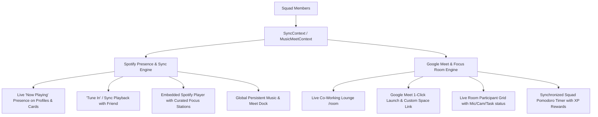

# Implementation Plan: Spotify & Google Meet Live Co-Working Environment

Integrate a synchronized **Spotify Listening Lounge** and **Google Meet Co-Working Room** into **SYNC**. This will allow friends to work together, hop on Google Meet calls, see what each friend is listening to in real time, and either listen to the same song together ("Squad Listening Party / Tune In") or listen to different songs independently while staying connected.

---

## User Review Required

> [!IMPORTANT]
> **Spotify Playback & OAuth vs Embedded Playback:**
> 1. **Immediate Out-of-the-Box Playback:** We will include real embedded Spotify Web Players (`open.spotify.com/embed`) with curated focus stations (Lofi Girl, Synthwave Coding, Ambient Focus, Deep Piano) plus custom Spotify URL/URI input. This allows immediate, working audio playback without forcing users to register a Spotify Developer App first.
> 2. **Spotify Developer Configuration:** We will also add `SPOTIFY_CLIENT_ID`, `SPOTIFY_CLIENT_SECRET`, and `NEXT_PUBLIC_SPOTIFY_REDIRECT_URI` to `.env` and `.env.example` along with client authorization helpers for users who wish to connect their private Spotify accounts.
>
> **Google Meet Integration:**
> - We will provide a 1-click **"Launch / Join Google Meet"** integration with configurable Squad Meet URLs (defaults to instant Google Meet room `https://meet.google.com/new` or custom group space `https://meet.google.com/syn-squad-prg`), complete with live in-app participant tiles, camera/mic status toggles, focus tasks, and synchronized Pomodoro sprint timers.

---

## Proposed Architecture & Features

---

## Proposed Changes

### 1. Data Models & Types

#### [MODIFY] [`src/types/index.ts`](file:///Users/Koushigan/projects/SYNC/src/types/index.ts)
- Add `SpotifyTrack` interface:
  - `id`, `title`, `artist`, `album`, `albumArt`, `spotifyUrl`, `embedUri`, `durationMs`.
- Add `UserMusicPresence` interface:
  - `userId`: ID of the squad member.
  - `isPlaying`: boolean.
  - `track`: `SpotifyTrack | null`.
  - `progressMs`: number.
  - `listeningWithUserId`?: ID of friend being tuned into (for synchronized listening).
  - `lastUpdated`: string timestamp.
- Add `FocusRoom` interface:
  - `meetUrl`: Google Meet URL for the squad.
  - `activeMemberIds`: list of users currently in the study room.
  - `isGroupListening`: boolean (whether room is in broadcast mode or solo mode).
  - `hostTrack`: track being broadcast to room participants.
  - `pomodoro`: synchronized 25/5 focus timer state.

---

### 2. State Management & Real-Time Sync

#### [NEW] [`src/context/MusicMeetContext.tsx`](file:///Users/Koushigan/projects/SYNC/src/context/MusicMeetContext.tsx)
- Provides centralized audio playback and live co-working room state:
  - `currentTrack`: User's current Spotify track.
  - `isPlaying`: Playback state.
  - `allPresences`: Dictionary of what every squad member is currently listening to (Alex, Elena, Marcus, Sarah, You).
  - `listeningWith`: If you are currently tuned into a friend's stream.
  - `focusRoom`: Google Meet URL, room participants, and synchronized Pomodoro.
- Actions:
  - `togglePlay()`: Play or pause track.
  - `changeTrack(track)`: Change current track.
  - `tuneInToMember(memberId)`: Instantly sync your playback with that friend's current track.
  - `stopTuneIn()`: Return to personal listening mode.
  - `joinFocusRoom()` / `leaveFocusRoom()`: Enter/exit the virtual co-working space.
  - `setMeetUrl(url)`: Customize the squad's Google Meet room URL.
  - `togglePomodoro()`: Start/pause the shared focus timer.

#### [MODIFY] [`src/lib/demo-data.ts`](file:///Users/Koushigan/projects/SYNC/src/lib/demo-data.ts)
- Add initial Spotify presence for all 4 friends + current user:
  - Alex Chen: *Lofi Girl — Snowfall (Chillhop Music)*
  - Elena Rostova: *Ludovico Einaudi — Nuvole Bianche (Focus Piano)*
  - Marcus Vance: *Kavinsky — Nightcall (Synthwave Coding)*
  - Sarah Lin: *Tycho — Awake (Ambient Electronic)*
  - You: *Hans Zimmer — Time (Interstellar Deep Work)*
- Add curated focus stations (Lofi Beats, Coding Synthwave, Ambient Piano, Techno Sprint).

---

### 3. Persistent UI & Navigation

#### [NEW] [`src/components/music/MusicMeetDock.tsx`](file:///Users/Koushigan/projects/SYNC/src/components/music/MusicMeetDock.tsx)
- A sleek, floating bottom bar present across all pages:
  - **Left:** Now Playing track art, title, artist, Spotify monogram, animated sound equalizer waves (`|||||`).
  - **Center:** Quick controls (Play/Pause, Skip, Scrobbler bar, and "Listening with [Friend Name]" badge when tuned in).
  - **Right:** 
    - Mini avatar stack showing squad members currently listening on Spotify (hovering shows what each is listening to with 1-click "Tune In").
    - **"Google Meet" button**: Shows active room member count with 1-click launch to open the squad's Google Meet.
    - Expand/collapse toggle.

#### [MODIFY] [`src/components/navigation/TopNav.tsx`](file:///Users/Koushigan/projects/SYNC/src/components/navigation/TopNav.tsx)
- Add **"Focus Room"** (`/room`) to main navigation links with a live badge (e.g. green pulse indicator when squad members are in Google Meet / study room).

#### [MODIFY] [`src/components/navigation/BottomNav.tsx`](file:///Users/Koushigan/projects/SYNC/src/components/navigation/BottomNav.tsx)
- Add "Room" icon to the mobile navigation dock.

#### [MODIFY] [`src/components/layout/AppShell.tsx`](file:///Users/Koushigan/projects/SYNC/src/components/layout/AppShell.tsx)
- Mount `<MusicMeetDock />` so the Spotify player and Meet status persist as the user navigates between Dashboard, Schedule, Leaderboard, etc.

---

### 4. Collaborative Focus Room View (`/room`)

#### [NEW] [`src/app/room/page.tsx`](file:///Users/Koushigan/projects/SYNC/src/app/room/page.tsx)
- A dedicated, high-aesthetic virtual co-working hub:
  1. **Google Meet Hub Header:**
     - Direct "Launch Google Meet" button (opens meet in new tab / pop-up).
     - Editable Meet link (`https://meet.google.com/...`) so friends can connect their custom group meet.
     - Live presence count ("3 squad members in call").
  2. **Live Co-Working Grid:**
     - Member video/avatar cards showing:
       - Video placeholder / avatar with active speaking indicator.
       - Mic & Camera status toggles.
       - Current task they are working on (linked to their scheduled tasks!).
       - **Live Spotify Badge**: Track name, artist, animated wave bars, and 1-click "Tune In" button.
  3. **Squad Spotify Jukebox & Station Console:**
     - Embedded Spotify Player with live audio playback.
     - **Mode Switch**: "Broadcast to Squad" (Listen Together) vs "Solo Stream" (Personal Beats).
     - Preset Focus Playlists (Lofi Girl, Synthwave, Deep Focus, Classical Piano).
     - Custom Spotify URL / Track loader.
  4. **Synchronized Pomodoro Timer:**
     - 25m Focus / 5m Rest countdown synced for everyone in the room.
     - +15 XP bonus notification for all participants when a synchronized study session completes!

---

### 5. Friend Cards & Profile Integration

#### [MODIFY] [`src/app/friends/page.tsx`](file:///Users/Koushigan/projects/SYNC/src/app/friends/page.tsx)
- On each friend's card:
  - Add a **Live Spotify Pill**: displays animated audio wave visualizer, current track title, and artist.
  - Hover / Click opens a mini "Tune In" drawer:
    - View album artwork.
    - Button: **"🎧 Listen Together (Tune In)"** — switches your player to the exact same track!
    - Button: **"Open in Spotify"**.
- In the Head-to-Head Comparison tab:
  - Compare "Focus Music Taste" / "Top Coding Genre" (Lofi, Synthwave, Ambient).

---

### 6. Environment & Configuration

#### [MODIFY] [`.env`](file:///Users/Koushigan/projects/SYNC/.env) & [`.env.example`](file:///Users/Koushigan/projects/SYNC/.env.example)
- Add Spotify API configuration placeholders:
  - `SPOTIFY_CLIENT_ID`
  - `SPOTIFY_CLIENT_SECRET`
  - `NEXT_PUBLIC_SPOTIFY_REDIRECT_URI`
  - `NEXT_PUBLIC_DEFAULT_MEET_URL`

---

## Verification Plan

### Automated & Build Verification
1. `npx tsc --noEmit` to verify type safety across all components and context providers.
2. `npm run build` to verify clean SSR and static page compilation.

### Manual Verification
1. **Spotify Presence Verification:**
   - Go to `/friends`: verify each friend displays their live Spotify track with moving equalizer bars.
   - Click "Tune In" on a friend: verify your player updates to match their track with "Listening with [Friend]" indicator.
2. **Persistent Player Verification:**
   - Test floating `MusicMeetDock` at bottom: toggle play/pause, change tracks, minimize and expand.
   - Navigate across pages (`/`, `/schedule`, `/friends`, `/leaderboard`, `/room`): verify music playback and dock state persist seamlessly without interruption.
3. **Focus Room & Google Meet Verification:**
   - Navigate to `/room`:
     - Test "Launch Google Meet" button (opens configured Google Meet URL).
     - Test editing the Google Meet link.
     - Test "Squad Listening Party" vs "Solo Stream" modes.
     - Test Spotify station switching (Lofi, Synthwave, Ambient, Piano).
     - Test the synchronized Pomodoro sprint timer.
